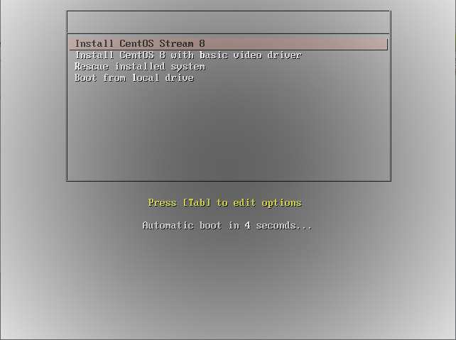
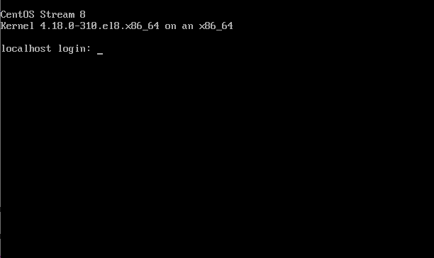
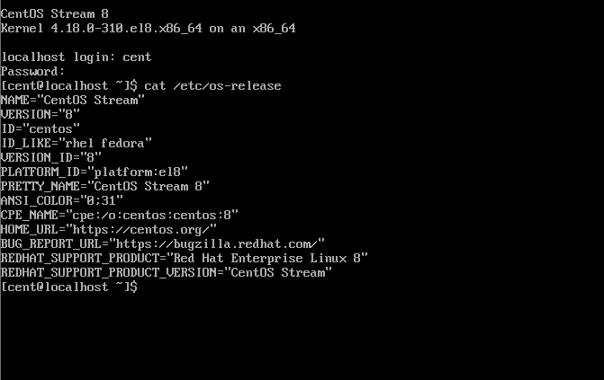

# Install CentOS Stream to client computers from a PXE Server via network.

# Objective
 	
To Configure PXE (Preboot execution Environment) Server. Your computer needs to have a NIC with PXE support. 
It's useful if your client computer has no CD/DVD drive. 

# 

**PXE Server** – Preboot eXecution Environment is a standardized client-server architecture that instructs a client system to boot, run, or install multiple Linux operating systems using a PXE-capable network interface on your network infrastructure.

> [!NOTE]
> [Requirements]
> 1. Installation of CentOS 8 Minimal Server or RHEL 8 Minimal Server
> 2. Configure Static IP Address in RHEL/CentOS 8

In my Home Lab setup. I am using two nodes for implementing the PXE Boot Server. 

|Hostname  | IP Address  | CPU  | Memory  |
|---------|---------|---------|---------|
|pxe-server.firebolt.para.in | 192.168.0.3  | 2 vCPU  |   8      |
|client1.firebolt.para.in    | 192.168.0.5  | 2 vCPU  |   4      |

For Installation login redhat subscription. 

    [root@pxe-server ~]# subscription-manager register --auto-attach 

Install some packages. 

    [root@pxe-server ~]# yum install wget curl tree tmux git -y 

Install and Start TFTP
    
    [root@pxe-server ~]# dnf -y install tftp-server 
    [root@pxe-server ~]# systemctl enable --now tftp.socket 

If firewall is running, allow tftp service. 

    [root@pxe-server ~]# firewall-cmd --permanent --add-service=tftp 
    [root@pxe-server ~]# firewall-cmd --reload 

If don't wish use firewall service, stop and disable firewall service. 

    [root@pxe-server ~]# systemctl disable firewalld 
    [root@pxe-server ~]# systemctl stop firewalld 

Disable Selinux Policy. 

    [root@pxe-server ~]# vim /etc/selinux/config 
    SELINUX = disabled 

    [root@pxe-server ~]# setenforce 0 

Configure DHCP Server.

    [root@pxe-server ~]# yum install dhcp* -y 

Add the lines below in /etc/dhcpd/dhcpd.conf file. 

    [root@pxe-server ~]# cat /etc/dhcp/dhcpd.conf 
    #
    # DHCP Server Configuration file.
    #   see /usr/share/doc/dhcp-server/dhcpd.conf.example
    #   see dhcpd.conf(5) man page
    #
    option domain-name            "firebolt.para.in";
    option domain-name-servers    pxe-server.firebolt.para.in;
    default-lease-time 600;
    max-lease-time 7200;
    authoritative;
    # add follows
    option space pxelinux;
    option pxelinux.magic code 208 = string;
    option pxelinux.configfile code 209 = text;
    option pxelinux.pathprefix code 210 = text;
    option pxelinux.reboottime code 211 = unsigned integer 32;
    option architecture-type code 93 = unsigned integer 16;
    
    subnet 192.168.0.0 netmask 255.255.255.0 {
        range dynamic-bootp 192.168.0.5 192.168.0.10;
        option broadcast-address 192.168.0.255;
        option routers 192.168.0.1;
        
        # add follows
        class "pxeclients" {
            match if substring (option vendor-class-identifier, 0, 9) = "PXEClient";
            # PXE servers hostname or IP address
            next-server pxe-server.firebolt.para.in;
    
            if option architecture-type = 00:07 {
                filename "BOOTX64.EFI";
            }
            else {
                filename "pxelinux.0";
            }
        }
    }
    
Start and enable dhcpd service. 

    [root@pxe-server ~]# systemctl enable --now dhcpd
    [root@pxe-server ~]# systemctl status dhcpd
    ● dhcpd.service - DHCPv4 Server Daemon
       Loaded: loaded (/usr/lib/systemd/system/dhcpd.service; enabled; vendor preset: disabled)
       Active: active (running) since Fri 2024-02-02 16:53:36 IST; 6min ago
 
That's OK to configure basic PXE settings.

  	
# Network Installation 

 	
Automate Network Installation by Kick Start. 

## Configure Kick Start settings

- generate password
- remember it

This is the one for root or other users password

    [root@pxe-server ~]# /usr/libexec/platform-python -c 'import crypt,getpass; \
    print(crypt.crypt(getpass.getpass(), \
    crypt.mksalt(crypt.METHOD_SHA512)))'
    Password:
    $6$WRwalxY/5EpHO0DI$qVymqI.....
    
    [root@pxe-server ~]# mkdir /var/www/html/ks
    
    [root@pxe-server ~]# vi /var/www/html/ks/rhel8.cfg
     # create new
    
    # graphical installation
    graphical
    
    # reboot after installing
    reboot
    
    # installation source (AppStream)
    repo --name="AppStream" --baseurl=http://192.168.0.3/rhel8/AppStream
    # installation source (Base)
    url --url="http://192.168.0.3/rhel8"
    
    # installation packages
    %packages
    @^minimal-environment
    kexec-tools
    %end
    
    # keyboard layouts
    keyboard --xlayouts='en','us'
    
    # system locale
    lang en_US.UTF-8
    
    # network settings
    network  --hostname=client.firebolt.para.in
    
    # enable first boot setup
    firstboot --enable
    
    ignoredisk --only-use=nvme0n1
    
    # initialize all partition tables
    clearpart --none --initlabel
    
    # partitioning
    autopart --type=lvm
    
    # system timezone
    timezone Asia/Kolkata --isUtc --nontp
    
    # root password
    rootpw --iscrypted $6$Rt6tHMShvLuo0Hbo$1NJShHmy8QgntsnKSLf/ujfbX6TNUAjo8zicB9AE/nnx6swgyOr/u6HO4VqrYL6.Sww0HdVQc0zELeIwvzZCc.
    # for other user settings if adding
    #user --name=client --password=$6$OoKl.ypO5f2KeqdY$ez1Kt5h8RkrYIb9HPLAjKGLtpTwnygX5.qRaTxJSzq3mGTuEfo8kfdXys7v.gHQljH9Pist2X4JX5HziRKXYs. --iscrypted --gecos="client"
    

    [root@pxe-server ~]# chmod 644 /var/www/html/ks/rhel8-ks.cfg 

Download an ISO image of CentOS Stream first to your PXE server. On the example below, CentOS Stream 8 ISO image is under [/root]. 

    [root@pxe-server ~]# dnf -y install syslinux
    [root@pxe-server ~]# cp /usr/share/syslinux/pxelinux.0 /var/lib/tftpboot/
    [root@pxe-server ~]# mkdir -p /var/pxe/rhel8
    
    [root@pxe-server ~]# mkdir /var/lib/tftpboot/rhel8
    
    [root@pxe-server ~]# mount -t iso9660 -o loop,ro /home/CentOS-Stream-8-x86_64-20210617-dvd1.iso /var/pxe/rhel8
    
    [root@pxe-server ~]# cp /var/pxe/rhel8/images/pxeboot/{vmlinuz,initrd.img} /var/lib/tftpboot/rhel8/
    
    [root@pxe-server ~]# cp /usr/share/syslinux/{menu.c32,vesamenu.c32,ldlinux.c32,libcom32.c32,libutil.c32} /var/lib/tftpboot/
    [root@pxe-server ~]# mkdir /var/lib/tftpboot/pxelinux.cfg
    
    [root@pxe-server ~]# vi /var/lib/tftpboot/pxelinux.cfg/default 
    default vesamenu.c32
    prompt 1
    timeout 60
    
    display boot.msg
    
    label linux
      menu label ^Install RHEL 8 using kickstart
      menu default
      kernel rhel8/vmlinuz
    #  append initrd=rhel8/initrd.img ip=dhcp inst.repo=http://192.168.0.3/rhel8
      append initrd=rhel8/initrd.img ip=dhcp inst.ks=http://192.168.0.3/ks/rhel8.cfg
    label vesa
      menu label Install RHEL 8 with ^basic video driver
      kernel rhel8/vmlinuz
      append initrd=rhel8/initrd.img ip=dhcp inst.xdriver=vesa nomodeset inst.repo=http://192.168.0.3/rhel8
    label rescue
      menu label ^Rescue installed system
      kernel rhel8/vmlinuz
      append initrd=rhel8/initrd.img rescue
    label local
      menu label Boot from ^local drive
      localboot 0xffff    

Install httpd Package. 

    [root@pxe-server ~]# yum install httpd -y
    [root@pxe-server ~]# vi /etc/httpd/conf.d/pxeboot.conf        
    # create new
    
    Alias /rhel8 /var/pxe/rhel8
    <Directory /var/pxe/rhel8>
        Options Indexes FollowSymLinks
        # access permission
        Require ip 127.0.0.1 192.168.0.0/24
    </Directory>

    [root@pxe-server ~]# systemctl restart httpd

Enable network booting on BIOS settings of client computer and start it, then installation menu you set is shown, push Enter key to proceed to install. 

After finishing successfully, that's OK if CentOS Stream started normally. 

